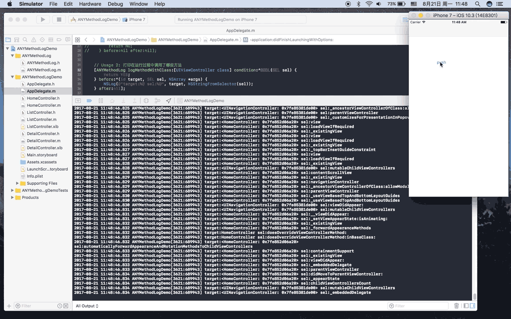

# ANYMethodLog - log any method call of object in Objective-C  
[English](../master/readme-en.md)


打印 Objective-C 对象中的任何方法  


  
## 调用说明:  

```objective-c
+ (void)logMethodWithClass:(Class)aClass
                 condition:(BOOL(^)(SEL sel)) condition
                    before:(void(^)(id target, SEL sel, NSArray *args, int deep)) before
                     after:(void(^)(id target, SEL sel, NSArray *args, NSTimeInterval interval, int deep, id retValue)) after;
```

aClass：要打印的类

condition：根据此 block 来决定是否追踪方法（sel 是方法名）

before：方法调用前会调用该 block（target 是检测的对象，sel 是方法名，args 是参数列表，deep 是调用层级）

after：方法调用后会调用该 block（interval 是执行方法的耗时，retValue 是返回值）

## 功能：
1.打印一个类定义的所有方法，包括公开方法和私有方法：  

```objective-c
[ANYMethodLog logMethodWithClass:[UIViewController class] condition:^BOOL(SEL sel) {
    NSLog(@"method:%@", NSStringFromSelector(sel));
    return NO;
} before:nil after:nil];
```

2.打印在运行过程中调用了哪些方法：  

```objective-c
[ANYMethodLog logMethodWithClass:[UIViewController class] condition:^BOOL(SEL sel) {
    return YES;
} before:^(id target, SEL sel, NSArray *args, int deep) {
    NSLog(@"target:%@ sel:%@", target, NSStringFromSelector(sel));
} after:nil];
```

3.打印特定几个方法的调用顺序：  

```objective-c
[ANYMethodLog logMethodWithClass:[UIViewController class] condition:^BOOL(SEL sel) {
    
    NSArray *whiteList = @[@"loadView", @"viewWillAppear:", @"viewDidAppear:", @"viewWillDisappear:", @"viewDidDisappear:", @"viewWillLayoutSubviews", @"viewDidLayoutSubviews"];
    return [whiteList containsObject:NSStringFromSelector(sel)];
    
} before:^(id target, SEL sel, NSArray *args, int deep) {
    
    NSLog(@"target:%@ sel:%@", target, NSStringFromSelector(sel));
    
} after:nil];
```

4.打印调用方法时的参数值：  

```objective-c
[ANYMethodLog logMethodWithClass:NSClassFromString(@"UIViewController") condition:^BOOL(SEL sel) {
    
    return [NSStringFromSelector(sel) isEqualToString:@"viewWillAppear:"];

} before:^(id target, SEL sel, NSArray *args, int deep) {

    NSLog(@"before target:%@ sel:%@ args:%@", target, NSStringFromSelector(sel), args);

} after:nil];
```

5.打印某个方法调用前后的变化：  

```objective-c
[ANYMethodLog logMethodWithClass:NSClassFromString(@"ListController") condition:^BOOL(SEL sel) {

    return [NSStringFromSelector(sel) isEqualToString:@"changeBackground"];

} before:^(id target, SEL sel, NSArray *args, int deep) {

    NSLog(@"before background color:%@", [(ListController *)target view].backgroundColor);

} after:^(id target, SEL sel, NSArray *args, NSTimeInterval interval, int deep, id retValue) {
    
    NSLog(@"after background color:%@", [(ListController *)target view].backgroundColor);
    
}];
```

6.打印某个方法调用的耗时：  

```objective-c
[ANYMethodLog logMethodWithClass:NSClassFromString(@"ListController") condition:^BOOL(SEL sel) {
    
    return [NSStringFromSelector(sel) isEqualToString:@"changeBackground"];
    
} before:^(id target, SEL sel, NSArray *args, int deep) {
    
    
} after:^(id target, SEL sel, NSArray *args, NSTimeInterval interval, int deep, id retValue) {
    
    NSLog(@"interval::%@", [@(interval) stringValue]);
    
}];
```

7.追踪方法调用顺序： 

```objective-c
[ANYMethodLog logMethodWithClass:NSClassFromString(@"ListController") condition:^BOOL(SEL sel) {
    return  YES;
} before:^(id target, SEL sel, NSArray *args, int deep) {
    NSString *selector = NSStringFromSelector(sel);
    NSArray *selectorArrary = [selector componentsSeparatedByString:@":"];
    selectorArrary = [selectorArrary filteredArrayUsingPredicate:[NSPredicate predicateWithFormat:@"length > 0"]];
    NSMutableString *selectorString = [NSMutableString new];
    for (int i = 0; i < selectorArrary.count; i++) {
        [selectorString appendFormat:@"%@:%@ ", selectorArrary[i], args[i]];
    }
    NSMutableString *deepString = [NSMutableString new];
    for (int i = 0; i < deep; i++) {
        [deepString appendString:@"-"];
    }
    NSLog(@"%@[%@ %@]", deepString , target, selectorString);
} after:^(id target, SEL sel, NSArray *args, NSTimeInterval interval, int deep, id retValue) {
    NSMutableString *deepString = [NSMutableString new];
    for (int i = 0; i < deep; i++) {
        [deepString appendString:@"-"];
    }
    NSLog(@"%@ret:%@", deepString, retValue);
}];
```

## TODO：  

+ 解决真机上运行出现的问题。 (已完成)  
+ 打印调用时的参数值。 (已完成)  
+ 打印返回值。 (已完成)  
+ 计算某个方法的耗时。 (已完成)  

## 原理：  

<del>利用runtime交换方法的实现。动态创建新方法，在新方法里再调用原来的方法。现阶段还不是很完美地调用原来方法，在需要传参的方法会出现传参失败，在真机问题较多，在模拟器问题较少，在用的时候可以过滤掉需要传参的方法。</del>

1.把原方法的 `IMP` 换成 `_objc_msgForward` ，使之触发 `forwardInvocation` 方法；

2.把方法 `forwardInvocation` 的 `IMP` 换成 `qhd_forwardInvocation` ；

3.创建一个新方法，`IMP` 就是原方法的原来的 `IMP`，那么只要在 `qhd_forwardInvocation` 调用新方法即可。那么就可以在 `qhd_forwardInvocation` 插入 log 。

欢迎提 Issues 和 Pull requests

